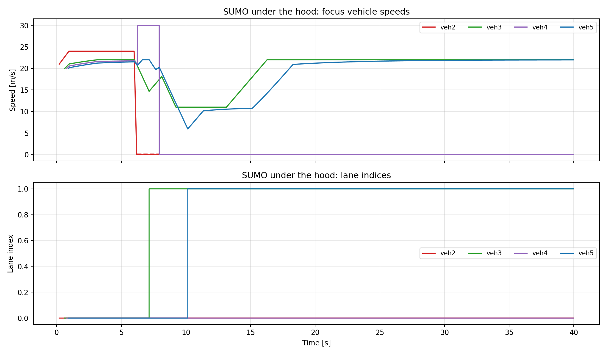
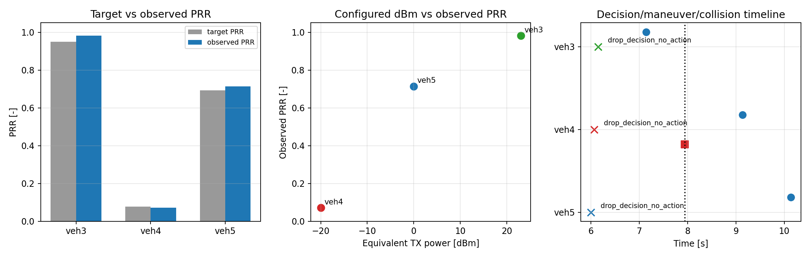
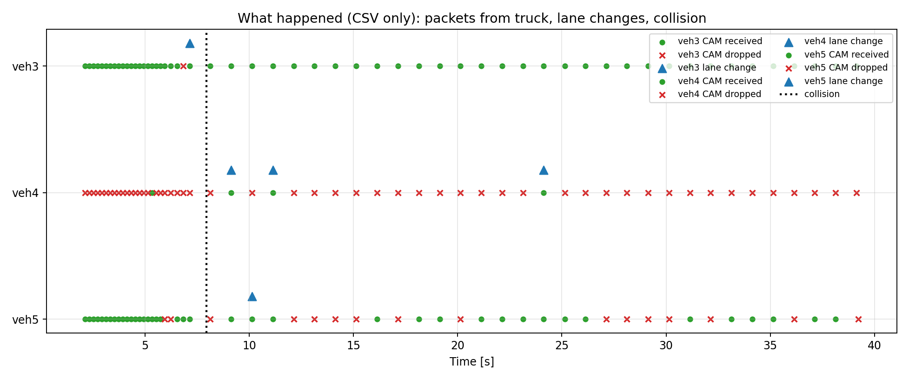
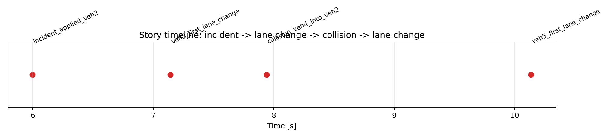
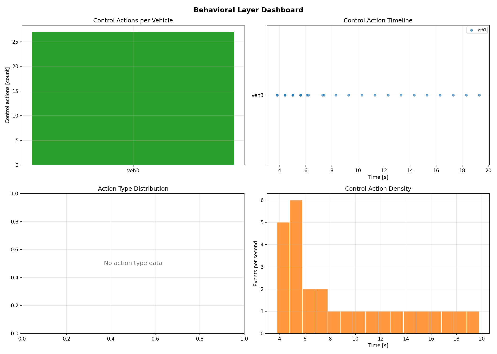
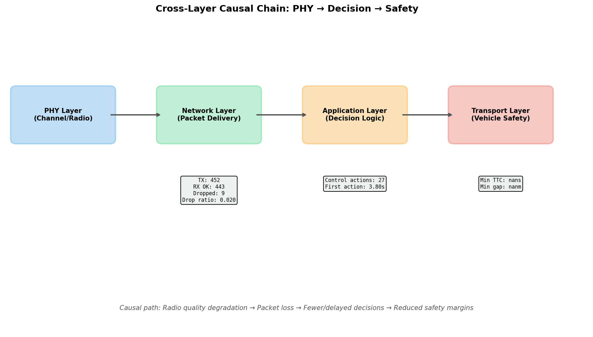
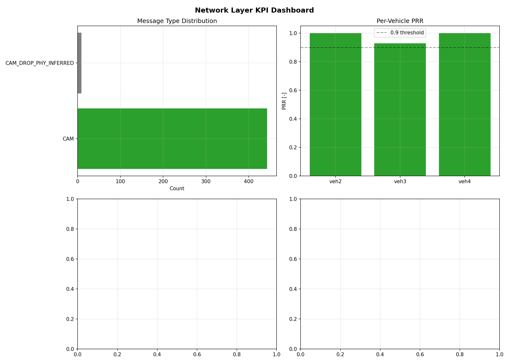
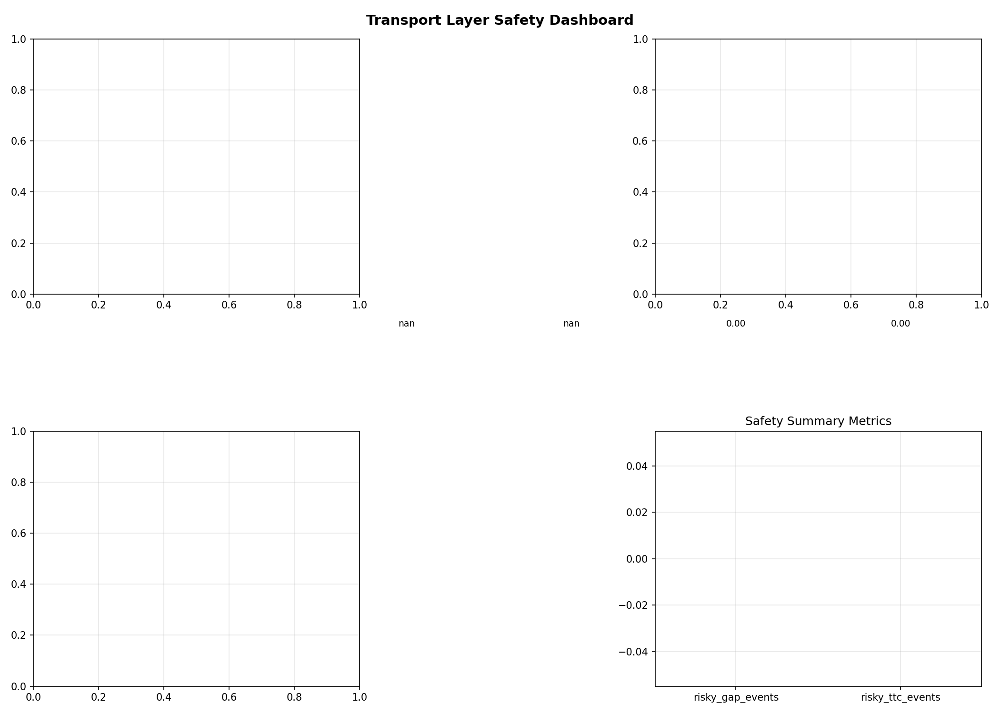

# Отчет по наработкам в репозитории NEWWAY за цикл 7

## 1. Назначение отчета и краткий итог цикла

Этот отчет подготовлен как подробная фиксация выполненных наработок в
репозитории `NEWWAY` по линии воспроизводимых V2X-сценариев, доказательной
аналитики и оформленных артефактов экспериментов.

Ключевая цель отчета — собрать в одном месте:

- как устроен репозиторий и какие сценарии в нем есть;
- как поднимать проект и запускать основные кейсы;
- какие артефакты формируются на выходе;
- какие результаты уже подтверждены конкретными `CSV/PNG/summary` файлами;
- какие блоки готовы к дальнейшему расширению в следующем цикле и в ВКР.

Итог цикла по факту выполненных работ:

- систематизирована карта сценариев и команд запуска;
- выделены базовые, валидированные и пользовательские сценарии;
- собран набор доказательных артефактов для кейсов `lane-change` и `intersection crash`;
- зафиксирован аналитический контур `связь -> решение -> поведение/исход`;
- подготовлен пакет локальных материалов для переноса на страницу в `Notion`.

## 2. Источники, внешние гайды и используемая среда

### 2.1. Основные источники внутри репозитория

- `README.md`
- `DEVELOPMENT.md`
- `scenarios/README.md`
- `my_scenarios/README.md`
- `raw_experiments/README.md`
- `docs/results_schema.md`
- `analysis/scenario_runs/README.md`
- `cycle7_fizulin_av/README.md`
- `cycle7_fizulin_av/chapter2_razrabotka.md`
- `cycle7_fizulin_av/chapter3_experiment.md`
- `1/README.md`
- `1/chapter2_razrabotka.md`
- `1/chapter3_experiment.md`
- `1/materials_manifest.md`
- `1/source_digest.md`

### 2.2. Дополнительные внешние и встроенные источники

- документация `ms-van3t / NEWWAY` через ссылку из `README.md`
- документация `ns-3`
- документация `SUMO`
- материалы по `Sionna`, используемые через интеграцию, описанную в `README.md`

### 2.3. Используемая среда

Практическая работа в проекте опирается на следующие компоненты:

- overlay-репозиторий `NEWWAY`, который разворачивается поверх `ns-3-dev`
- транспортный симулятор `SUMO`
- стек `ns-3` с подсистемами `automotive`, `nr`, `traci`, `sionna`
- сценарные launchers `run.sh`, которые в ряде случаев умеют автоматически
  поднимать локальное дерево `ns-3-dev`

Критичные замечания по среде, зафиксированные в репозитории:

- `Ubuntu 24.04` явно помечена как официально не поддерживаемая в главном `README.md`
- новые версии `SUMO` потенциально могут ломать интеграцию
- `sandbox_builder.sh` действует разрушительно и требует аккуратного использования
- часть сценариев, особенно `Sionna`-связанных, чувствительна к наличию GPU,
  корректной Python-среды и доступного локального/удаленного сервера

## 3. Как поднять проект и подготовить рабочее окружение

### 3.1. Базовый workflow установки

Согласно `README.md` и `DEVELOPMENT.md`, базовый путь выглядит так:

1. Клонировать `NEWWAY`.
2. Выполнить bootstrap:
   - `printf '\n' | ./sandbox_builder.sh`
   - либо `printf '\n' | ./sandbox_builder.sh install-dependencies`
3. Перейти в созданный `ns-3-dev`.
4. Сконфигурировать сборку:

```bash
./ns3 configure --build-profile=optimized --enable-examples --enable-tests --disable-python --disable-werror
```

5. Собрать нужные таргеты:

```bash
./ns3 build -j 2
```

или минимальный таргет:

```bash
./ns3 build -j 2 v2v-simple-cam-exchange-80211p
```

### 3.2. Отличие обычной установки от сценарных launchers

Практически важный момент: в `scenarios/README.md` зафиксировано, что многие
`run.sh` теперь умеют:

- автоматически искать уже существующее дерево `ns-3-dev`;
- при необходимости поднимать bootstrap-дерево в `.bootstrap-ns3`;
- выполнять `./ns3 configure`, если это нужно для целевого сценария;
- работать даже из `root-shell` через `NS3_USER_OVERRIDE`.

Это снижает порог воспроизводимости: для ряда сценариев не требуется отдельно
вручную проходить весь путь подготовки, если launcher уже может сделать это сам.

### 3.3. Ключевые управляющие переменные

В ходе работы с launchers используются, в том числе, следующие переменные:

- `NS3_DIR`
- `OUT_DIR`
- `PLOT`
- `RUN_ARGS`
- `USE_SIONNA`
- `EXPORT_RESULTS`
- `NS3_CONFIGURE_ARGS`
- `NS3_REQUIRE_OPTIMIZED`
- `AUTO_BOOTSTRAP_NS3`

## 4. Карта репозитория и логика организации сценариев

### 4.1. Общая структура

| Каталог | Роль |
|---|---|
| `scenarios/` | основной набор operational launchers для ключевых сценариев |
| `valid_scenario/` | валидированный lane-change кейс для доказательной части |
| `valid_intersection_scenario/` | валидированный junction crash кейс |
| `valid_cpm_perception_scenario/` | сравнение sensor-only и CPM |
| `valid_intersection_radar_comm_scenario/` | intersection кейс с radar/V2X режимами |
| `my_scenarios/` | упакованные пользовательские сценарии и wrapper-слой поверх валидированных кейсов |
| `raw_experiments/` | raw-only прогоны без полной постобработки |
| `analysis/scenario_runs/` | накопленные прогоны, figures, reports, exports, audit |
| `tools/results_pipeline/` | CSV-first pipeline нормализации и агрегирования |
| `analysis/mode2_loss/` | смежные исследовательские наработки |
| `analysis/vkr/` | материалы для дальнейшего использования в ВКР |

### 4.2. Логика слоев

По смыслу репозиторий в части сценариев делится на несколько уровней:

1. **Базовые сценарии** — находятся в `scenarios/` и дают стандартный способ
   запуска ключевых кейсов и получения артефактов.
2. **Валидированные сценарии** — находятся в `valid_*` и фиксируют уже
   отработанные доказательные кейсы.
3. **Пользовательские wrapper-сценарии** — находятся в `my_scenarios/` и дают
   компактный, оформленный слой для повторного запуска и дальнейшего
   использования в отчетности.
4. **Raw-режим** — находится в `raw_experiments/` и нужен, когда требуется
   сохранить минимально обработанные исходные файлы симуляции.

## 5. Основные сценарии и команды запуска

### 5.1. Таблица сценариев

| Сценарий | Назначение | Команда запуска | Ключевые артефакты |
|---|---|---|---|
| `cttc-nr-v2x-demo-simple` | минимальный NR sidelink кейс | `scenarios/cttc-nr-v2x-demo-simple/run.sh` | `.db`, log, figures |
| `nr-v2x-west-to-east-highway` | highway-сценарий с KPI в SQLite | `scenarios/nr-v2x-west-to-east-highway/run.sh` | `.db`, log, figures |
| `v2v-cam-exchange-sionna-nrv2x` | обмен CAM, optional Sionna | `scenarios/v2v-cam-exchange-sionna-nrv2x/run.sh` | `phy_with_sionna_nrv2x.csv`, `prr_with_sionna_nrv2x.csv`, figures |
| `v2v-coexistence-80211p-nrv2x` | coexistence двух технологий | `scenarios/v2v-coexistence-80211p-nrv2x/run.sh` | per-tech KPI CSV, `sinr_ni.csv`, figures |
| `v2v-emergencyVehicleAlert-nrv2x` | основной `loss -> decision -> behavior` кейс | `scenarios/v2v-emergencyVehicleAlert-nrv2x/run.sh` | `*-CAM.csv`, `*-MSG.csv`, `*-CTRL.csv`, `collision_risk/*`, `drop_decision_timeline/*` |
| `valid_scenario` | зафиксированный lane-change кейс | `valid_scenario/run.sh` | story/intuitive artifacts, collision, timeline |
| `valid_intersection_scenario` | зафиксированный priority junction crash кейс | `valid_intersection_scenario/run.sh` | `intersection_summary.csv`, collision, timeline |
| `valid_cpm_perception_scenario` | сравнение sensor-only и CPM | `valid_cpm_perception_scenario/run.sh` | `cpm_perception_mode_summary.csv` при наличии полного прогона |
| `valid_intersection_radar_comm_scenario` | radar + V2X intersection | `valid_intersection_radar_comm_scenario/run.sh` | `intersection_radar_comm_mode_summary.csv` при наличии полного прогона |
| `my_scenarios/truck_lane_change_scenario` | компактный пользовательский lane-change кейс | `my_scenarios/truck_lane_change_scenario/run.sh` | compact CSV outputs, `source_run.txt` |
| `my_scenarios/intersection_crash_scenario` | компактный junction crash кейс | `my_scenarios/intersection_crash_scenario/run.sh` | compact CSV outputs, `source_run.txt` |
| `my_scenarios/compare_tech` | пакет сравнения технологий | `my_scenarios/compare_tech/run.sh` | `compare_tech_summary.csv` при наличии полного прогона |
| `raw_experiments/truck_lane_change_5glena_raw` | raw-only 5G-LENA кейс | `raw_experiments/truck_lane_change_5glena_raw/run.sh` | raw log, netstate, collision, `.db` |
| `scenarios/5g-phy-metrics` | self-contained PHY metrics experiment | `scenarios/5g-phy-metrics/run.sh` | `phy-metrics-*.csv`, summary, plots |

### 5.2. Практически важные замечания по запуску

- Сценарии с `Sionna` требуют отдельного сервера и корректной Python-среды.
- `valid_cpm_perception_scenario` и `valid_intersection_radar_comm_scenario`
  прямо зависят от поднятого `Sionna` listener.
- `v2v-coexistence-80211p-nrv2x` использует специальный interference mode.
- `raw_experiments` важны как отдельный режим, когда нужно сохранить исходные
  артефакты без производных CSV/PNG.

## 6. Валидированные пользовательские сценарии

### 6.1. `truck_lane_change_scenario`

Это упакованный пользовательский сценарий, который делегирует запуск в
`valid_scenario/run.sh` и предоставляет компактный набор output-файлов.

Что подтверждено в репозитории:

- сценарий оформлен через `my_scenarios/truck_lane_change_scenario/README.md`
- присутствует `output/` с компактными CSV
- есть `source_run.txt`, указывающий на исходный run:

```text
source_run=/root/NEWWAY_runs/2026-03-05/valid_scenario_smoke_lowprr_safeflow_sionna_002111
scenario=valid_scenario/run.sh
```

### 6.2. `intersection_crash_scenario`

Это компактный пользовательский wrapper для `valid_intersection_scenario/run.sh`.

Что подтверждено:

- оформлен отдельный `README.md`
- присутствует `output/` с summary-файлами
- есть `source_run.txt`, указывающий на исходный run:

```text
source_run=/root/NEWWAY_runs/2026-03-05/intersection_conflict_crash_eqm25
scenario=valid_intersection_scenario/run.sh
```

### 6.3. Другие подготовленные контуры

В репозитории также подготовлены, но не все завершены количественно в виде
итоговых summary-файлов внутри самого репо:

- `my_scenarios/compare_tech`
- `my_scenarios/cpm_perception_scenario`
- `my_scenarios/intersection_radar_comm_scenario`

Их корректно трактовать как **подготовленные и runnable контуры экспериментов**,
а не как полностью закрытые количественные результаты текущего цикла.

## 7. Структура выходных артефактов

### 7.1. Базовые типы файлов

| Тип | Назначение |
|---|---|
| `*-MSG.csv` | события передачи, приема и потерь сообщений |
| `*-CTRL.csv` | управляющие решения и действия |
| `*-PROFILE.csv` | профиль связи и конфигурация для конкретного ТС |
| `*-CAM.csv` | данные по CAM для отдельного ТС |
| `*-PHY.csv` | PHY-level данные там, где сценарий их пишет |
| `eva-netstate.xml` | состояние трафика из `SUMO` |
| `eva-collision.xml` | факты столкновений |
| `.db` | SQLite-артефакты ряда сценариев |

### 7.2. Папки аналитики

| Каталог | Назначение |
|---|---|
| `collision_risk/` | safety-прокси: `min gap`, `min TTC`, timeseries и summary |
| `drop_decision_timeline/` | строгая связка `DROP_PHY -> DECISION` |
| `valid_scenario_story/` | дипломные story-графики по lane-change кейсу |
| `valid_scenario_intuitive/` | более наглядные графики и агрегаты для lane-change кейса |
| `chatgpt_exports/` | компактные export-бандлы после прогонов |

### 7.3. Results pipeline

Согласно `docs/results_schema.md` и `tools/results_pipeline/cli.py`,
pipeline в текущем виде дает:

- `normalized_events.csv`
- `aggregates_overall.csv`
- `diagnostics.csv`
- `run_metadata.json`
- `run_metadata.yaml`

Ключевые нормализованные поля:

- `run_id`
- `scenario`
- `source_kind`
- `event_type`
- `ts_us`
- `src_id`
- `dst_id`
- `pkt_id`
- `latency_us`
- `rssi_dbm`
- `sinr_db`
- `bler`
- `prr_value`
- `pdr_value`
- `success`
- `drop_reason`

Текущий статус pipeline:

- это **MVP CSV-first pipeline**
- он уже покрыт smoke-тестами в `tests/smoke_results_pipeline/*`
- он не является центральным доказательным блоком для всех сценариев, но уже
  задает основу для дальнейшей унификации результатов

## 8. Пайплайн аналитики и post-processing

### 8.1. Основные аналитические скрипты

| Скрипт | Назначение | Выход |
|---|---|---|
| `analysis/scenario_runs/analyze_netstate_collision_risk.py` | safety-прокси по `SUMO netstate` | `collision_risk_summary.csv`, timeseries, PNG |
| `analysis/scenario_runs/build_drop_decision_timeline.py` | strict `DROP_PHY -> DECISION` | `event_timeline.csv`, `summary.csv`, PNG |
| `analysis/scenario_runs/build_collision_causality_report.py` | causal audit перед collision | `collision_causality.csv`, `.md` |
| `analysis/scenario_runs/build_valid_scenario_story_plots.py` | story-графики lane-change кейса | набор PNG + CSV |
| `analysis/scenario_runs/build_valid_scenario_intuitive_plots.py` | наглядные CSV-only figures | набор PNG + CSV |
| `analysis/analyze_phy_safety.py` | PHY vs safety анализ | набор PHY-графиков |
| `analysis/plot_5g_phy_metrics.py` | PHY metrics plotting | набор PNG по PHY experiment |
| `analysis/scenario_runs/export_results_bundle.py` | compact export | export bundle + manifest |

### 8.2. Что это дает на практике

Важный результат текущего слоя аналитики состоит в том, что проект уже умеет
не только запускать сценарии, но и переводить результаты в:

- доказательные summary-файлы;
- временные графики;
- causal chain между drop-событием и decision-событием;
- связку network KPI с поведенческим исходом.

Именно этот слой является центральным отличием между просто runnable
сценарием и оформленным доказательным сценарием, пригодным для отчетности.

## 9. Подтвержденные результаты по фактическим артефактам

### 9.1. Lane-change кейс: подтвержденные числа

Источник:

- `evidence/csv/lane_change/intuitive_prr_summary.csv`
- `evidence/csv/lane_change/intuitive_dbm_prr_maneuver_chain.csv`
- `evidence/csv/lane_change/intuitive_key_events.csv`
- `evidence/csv/lane_change/drop_decision_summary.csv`

Итоговая таблица:

| ТС | final PRR | equiv dBm | target PRR | first lane change, s | decision outcome | collision |
|---|---:|---:|---:|---:|---|---:|
| `veh3` | 0.9444 | 23.0 | 0.9500 | 7.14358 | `maneuver_before_collision` | 0 |
| `veh4` | 0.2222 | -20.0 | 0.0770 | 8.13733 | `no_maneuver_before_collision` | 1 |
| `veh5` | 0.7500 | 0.0 | 0.6930 | — | `no_maneuver` | 0 |

Ключевые подтвержденные выводы:

- `veh3 final_prr = 0.9444`, и это соответствует безопасному маневру.
- `veh4 final_prr = 0.2222`, collision подтвержден.
- `veh5 final_prr = 0.7500`.
- В `intuitive_key_events.csv` зафиксировано:
  - `incident_time = 6.0 s`
  - `veh3_first_lane_change = 7.14358 s`
  - `veh4_first_lane_change = 8.13733 s`
  - `collision_time = 7.95 s`
- В `drop_decision_summary.csv` зафиксирован strict match ratio `1.0` по
  `787` drop-events.

### 9.2. Lane-change кейс: графики









### 9.3. Intersection crash кейс: подтвержденные числа

Источник:

- `evidence/csv/intersection/intersection_summary.csv`
- `evidence/csv/intersection/drop_decision_summary.csv`

Итоговая таблица:

| Показатель | Значение |
|---|---:|
| `target_prr` | 0.050000 |
| `observed_prr_from_tx` | 0.078947 |
| `first_cam_reaction_s` | 5.344580 |
| `first_drop_decision_no_action_s` | 3.800000 |
| `first_crash_mode_forced_speed_s` | 4.400000 |
| `first_collision_time_s` | 5.230000 |
| `collision_focus_with_veh2` | 1 |

Подтвержденные выводы:

- `veh3 observed_prr_from_tx = 0.078947`
- `first_drop_decision_no_action = 3.8 s`
- `first_crash_mode_forced_speed = 4.4 s`
- `collision_time = 5.23 s`
- strict match ratio `1.0` по `30` drop-events

### 9.4. Intersection crash кейс: графики









### 9.5. RSSI / safety sweep

Источник:

- `evidence/csv/sweeps/rssi_safety_summary.csv`

Подтвержденные строки:

| tx power, dBm | cam_avg_prr | eva_avg_prr | eva_avg_latency_ms | cam_mean_snr_db |
|---|---:|---:|---:|---:|
| 23.0 | 0.948478 | 0.971916 | 11.9522 | 29.4868 |
| 5.0 | 0.901136 | 0.931646 | 16.5808 | 14.3707 |

Вывод:

- при `23 dBm` выше `cam_avg_prr` и ниже `eva_avg_latency_ms`, чем при `5 dBm`
- это подтверждает работоспособность связки `RSSI/SNR/PRR -> latency` хотя в
  данном конкретном sweep значения safety-метрик `min_ttc_s` и `min_gap_m`
  совпадают

### 9.6. Sionna incident summary

Источники:

- `evidence/csv/sweeps/sionna_incident_summary_success.csv`
- `evidence/csv/sweeps/sionna_incident_summary_zero_attempt.csv`

Успешный sweep с ненулевыми KPI:

| tx power, dBm | backend | avg_prr | avg_latency_ms | control_actions |
|---|---|---:|---:|---:|
| 5.0 | sionna | 0.889197 | 18.9614 | 205 |
| 11.0 | sionna | 0.931000 | 15.2001 | 207 |
| 17.0 | sionna | 0.943776 | 14.1921 | 207 |
| 23.0 | sionna | 0.944698 | 13.0044 | 207 |

Что это показывает:

- использовать нужно только удачные summary-файлы с ненулевыми KPI
- при росте мощности от `5` к `23 dBm` наблюдается рост `avg_prr` и снижение
  `avg_latency_ms`

Отдельно важно зафиксировать, что существуют и промежуточные/неудачные попытки,
где summary заполнен нулями. Их корректно трактовать как часть рабочего цикла
отладки, а не как финальный результат.

### 9.7. Дополнительный EVA-блок из `cycle7_fizulin_av`

Отдельно от уже описанных lane-change и intersection кейсов в репозитории
оказался подготовлен еще один полезный пакет: `cycle7_fizulin_av/`.

Его сильная сторона состоит в том, что он фиксирует самостоятельную серию из
6 прогонов по `v2v-emergencyVehicleAlert-nrv2x` и содержит компактные derived
CSV, удобные для последующей публикации и построения графиков.

Источники:

- `evidence/csv/eva_series/summary-all-runs.csv`
- `evidence/csv/eva_series/per-vehicle-cam-from-ev.csv`
- `evidence/csv/eva_series/inter-cam-gaps.csv`
- `evidence/csv/eva_series/eva-good-speed-timeseries.csv`
- `evidence/csv/eva_series/eva-bad-speed-timeseries.csv`
- `evidence/csv/eva_series/eva-vbad-speed-timeseries.csv`
- `evidence/csv/eva_series/eva-lowpen-speed-timeseries.csv`

Сводная таблица по 6 прогонам:

| Label | TxPower, dBm | MCS | Retx | BW, MHz | Shadowing | PenRate | PRR | Latency, ms | Avg CAM from EV | Median gap, ms | Max gap, ms |
|---|---:|---:|---:|---:|---|---:|---:|---:|---:|---:|---:|
| `good` | 23 | 14 | 5 | 400 | OFF | 1.0 | 0.991558 | 11.4318 | 185 | 200 | 2400 |
| `medium` | 10 | 14 | 5 | 400 | ON | 1.0 | 0.975313 | 17.7809 | 171 | 400 | 4000 |
| `bad` | 5 | 20 | 5 | 400 | ON | 1.0 | 0.899322 | 29.1045 | 132 | 564 | 7936 |
| `vbad` | 0 | 20 | 1 | 10 | ON | 1.0 | 0.486843 | 33.0547 | 51 | 600 | 28500 |
| `noretx` | 23 | 14 | 1 | 400 | ON | 1.0 | 0.991948 | 12.4486 | 182 | 200 | 2400 |
| `lowpen` | 23 | 14 | 5 | 400 | OFF | 0.3 | 0.986401 | 12.1475 | 0 | 0 | 0 |

Что в этом блоке особенно интересно:

- `PRR` падает с `0.991558` до `0.486843`, то есть на `50.47` процентных пункта
  между `good` и `vbad`.
- `Latency` возрастает с `11.4318 ms` до `33.0547 ms`, то есть примерно в
  `2.89` раза.
- Среднее число CAM от emergency vehicle падает с `185` до `51`, то есть
  остается только `27.6%` от baseline.
- Максимальный `inter-CAM gap` вырастает с `2400 ms` до `28500 ms`.
- Конфигурация `noretx` при хорошем канале почти не отличается от baseline по
  `PRR`, что хорошо подчеркивает роль ретрансмиссий именно в ослабленном канале.

Поведенческий аспект по exported speed timeseries:

- сравнение `veh8` между `good` и `lowpen` показывает максимальную разницу
  скорости `13.2 m/s` и `28` временных точек с несовпадением полосы;
- для `good` vs `bad` максимальная разница скорости у `veh8` всего `0.48 m/s`,
  а для `good` vs `vbad` — `0.65 m/s` при одном несовпадении полосы.

Это полезно для интерпретации:

- умеренная деградация канала и даже очень плохой PHY-режим не всегда сразу
  приводит к сильному расхождению speed/lane profile в конкретном exported
  наблюдении;
- зато низкий penetration rate дает наиболее прямой и заметный поведенческий
  сдвиг, потому что часть автомобилей вообще не попадает в кооперативный контур.

Отдельная важная оговорка по этому пакету:

- его тексты содержат упоминание отдельного collision-сценария
  `v2v-degradation-collision-nrv2x`;
- в текущем проверенном дереве `src/automotive/examples/CMakeLists.txt`
  подтверждается target `v2v-emergencyVehicleAlert-nrv2x`, но target с именем
  `v2v-degradation-collision-nrv2x` в текущей конфигурации не найден;
- поэтому этот collision-блок корректно трактовать как полезную рабочую заметку
  из предыдущего пакета, но не как подтвержденный runnable target текущего
  отчета.

### 9.8. Low-level raw dataset по `5G-LENA / cttc-nr-v2x-demo-simple`

Отдельно в каталоге `1/` найден и оформлен полезный низкоуровневый набор
артефактов по стоковому примеру `cttc-nr-v2x-demo-simple`.

Источники:

- `evidence/csv/lena_db_dataset_inventory.csv`
- `evidence/csv/lena_pktTxRx_ide.csv`
- `evidence/csv/lena_psschRxUePhy_ide.csv`

Этот блок важен не как еще один high-level сценарий с готовой causal-chain,
а как мост к исходным raw данным `5G-LENA`, из которых можно строить более
низкоуровневую аналитику по `MAC/PHY`.

Сводный инвентарь двух найденных SQLite-баз:

| DB | Таблица | Строк | Временной диапазон |
|---|---|---:|---|
| `ide-test-nr-v2x-simple-demo.db` | `pktTxRx` | 38 | `2.11 .. 3.91958214 s` |
| `ide-test-nr-v2x-simple-demo.db` | `pscchRxUePhy` | 38 | `2111.517856 .. 3921.767856 ms` |
| `ide-test-nr-v2x-simple-demo.db` | `pscchTxUeMac` | 38 | `2111.5 .. 3921.75 ms` |
| `ide-test-nr-v2x-simple-demo.db` | `psschRxUePhy` | 19 | `2111.73214 .. 3919.48214 ms` |
| `ide-test-nr-v2x-simple-demo.db` | `psschTxUeMac` | 95 | `2111.5 .. 3924.25 ms` |
| `wsltest-nr-v2x-simple-demo.db` | `pktTxRx` | 98 | `2.11 .. 6.94208214 s` |
| `wsltest-nr-v2x-simple-demo.db` | `pscchRxUePhy` | 98 | `2111.517856 .. 6946.517856 ms` |
| `wsltest-nr-v2x-simple-demo.db` | `pscchTxUeMac` | 98 | `2111.5 .. 6946.5 ms` |
| `wsltest-nr-v2x-simple-demo.db` | `psschRxUePhy` | 49 | `2111.73214 .. 6941.98214 ms` |
| `wsltest-nr-v2x-simple-demo.db` | `psschTxUeMac` | 245 | `2111.5 .. 6946.75 ms` |

Что практически дает этот набор:

- таблица `pktTxRx` фиксирует прикладные `tx/rx` события и последовательности
  пакетов;
- таблицы `pscchTxUeMac` и `pscchRxUePhy` дают трассировку control-plane на
  уровне `MAC/PHY`;
- таблицы `psschTxUeMac` и `psschRxUePhy` позволяют анализировать transport
  channel, `SINR`, `TBLER` и факт `corrupt`;
- наличие CSV-экспортов облегчает быстрый просмотр и дальнейшее подключение к
  unified pipeline без обязательной ручной работы с SQLite.

Этот блок усиливает отчет в двух смыслах:

1. показывает, что в репозитории уже есть не только high-level summary, но и
   low-level сырые трассы стокового `5G-LENA` примера;
2. дает основу для следующего цикла, где можно формально связать `.db`-таблицы
   с `results_pipeline` и общей схемой унификации данных.

## 10. Дополнительные исследовательские материалы в репозитории

### 10.1. Блок `1/`

Каталог `1/` полезен как дополнительный packaging-layer поверх уже найденных
артефактов. В нем одновременно присутствуют:

- собственный `notion_report.md`;
- более академично оформленные главы `chapter2_razrabotka.md` и
  `chapter3_experiment.md`;
- `materials_manifest.md` и `source_digest.md`;
- подпакет `lena_db_dataset/` с raw `.db`, CSV-экспортами и inventory.

Именно из этого блока в текущий пакет был дополнительно встроен raw dataset по
`cttc-nr-v2x-demo-simple`, который делает отчет сильнее на уровне
доказательной базы и воспроизводимости.

### 10.2. Блок `cycle7_fizulin_av`

Помимо текущего собранного пакета, в репозитории был найден еще один
сфокусированный deliverable-блок:

- `cycle7_fizulin_av/README.md`
- `cycle7_fizulin_av/notion_report.md`
- `cycle7_fizulin_av/chapter2_razrabotka.md`
- `cycle7_fizulin_av/chapter3_experiment.md`
- `cycle7_fizulin_av/source_digest.md`

Его полезно рассматривать как дополнительный EVA-centered пакет:

- с собственной методической частью;
- со сводной серией из 6 прогонов;
- с derived CSV для построения публикационных графиков.

В текущий пакет этот блок встроен частично:

- подтвержденные CSV добавлены в `evidence/csv/eva_series/`
- ключевые выводы включены в раздел `9.7`
- спорные части по collision target оставлены только как оговорка, без
  включения в перечень подтвержденных runnable targets

### 10.3. Блок `analysis/mode2_loss`

Этот каталог оформлен как отдельный исследовательский workflow:

- live visualization
- processed metrics
- figures
- proof report

Его корректно включать в отчет как **смежные исследовательские наработки**, но
не смешивать с основным доказательным пакетом текущего цикла.

### 10.4. Блок `analysis/vkr`

В репозитории уже существует существенный задел для дальнейшего использования
в ВКР:

- `analysis/vkr/PLAN.md` — план структуры ВКР
- `analysis/vkr/VKR_inventory.md` — inventory рисунков и таблиц
- `analysis/vkr/VKR_chapter2_tool_development.md` — draft главы по
  инструментальной среде

Это важно, потому что текущая работа по сценариям и артефактам уже напрямую
перетекает в материал для последующего академического оформления.

### 10.5. Дополнительные визуальные приложения

В проекте есть и визуализационные материалы, которые можно использовать как
дополнительные иллюстрации:

- `evidence/img/extras/circle_v2v_animation.gif`
- `evidence/img/extras/intersection_v2i_animation.gif`

Использовать их стоит как приложение, а не как основной источник доказательства.

## 11. Ограничения, риски и проблемные места

| Область | Ограничение / риск | Комментарий |
|---|---|---|
| Окружение | `Ubuntu 24.04` не помечена как официально поддерживаемая | риск несовместимости сохраняется |
| `SUMO` | новые версии могут ломать интеграцию | требуется аккуратный выбор версии |
| Bootstrap | `sandbox_builder.sh` разрушителен | нужен disposable workflow |
| `Sionna` | требуется корректный listener и Python/GPU-окружение | часть сценариев без этого не стартует |
| Sweep-артефакты | часть summary-файлов содержит нули | это нужно показывать как промежуточные попытки |
| Старый EVA-пакет | часть его текстов ссылается на collision target, который не подтверждается текущим `CMakeLists.txt` | использовать как рабочую заметку, а не как полностью верифицированный target |
| `compare_tech` / `cpm` / `radar_comm` | не все блоки имеют зафиксированные итоговые summary в репо | описываются как подготовленные контуры, а не как полностью закрытые результаты |
| Источники lane-change output | compact output ссылается на `/root/NEWWAY_runs/...` | в пакете сохранены summary CSV, но не весь внешний run-dir |

## 12. Что готово для следующего цикла

По итогам текущего состояния репозитория к следующему циклу уже подготовлена
хорошая база:

- воспроизводимые launchers для ключевых сценариев;
- оформленные пользовательские wrapper-сценарии;
- доказательные lane-change и intersection кейсы;
- дополнительная EVA-серия из 6 прогонов с готовыми derived CSV;
- аналитические scripts и export-пакеты;
- заготовка для унификации результатов через `results_pipeline`;
- материалы, которые уже можно напрямую использовать в `Notion` и в ВКР.

Практически логичное продолжение работ:

1. Дозакрыть количественные summary для `compare_tech`,
   `cpm_perception_scenario`, `intersection_radar_comm_scenario`.
2. Расширить results pipeline с охватом большего числа источников данных.
3. Подготовить более формализованную карту `сценарий -> KPI -> behavioral outcome`.
4. Перенести финальный пакет в рабочую страницу `Notion`.

## 13. Приложения

### 13.1. Таблица ключевых подтвержденных результатов

| Блок | Подтвержденный результат |
|---|---|
| Lane-change | `veh3 final_prr = 0.9444`, безопасный маневр |
| Lane-change | `veh4 final_prr = 0.2222`, collision подтвержден |
| Lane-change | `veh5 final_prr = 0.7500` |
| Lane-change | `collision_time = 7.95 s` |
| Lane-change | strict match ratio `1.0` по `787` drop-events |
| Intersection | `observed_prr_from_tx = 0.078947` |
| Intersection | `first_drop_decision_no_action = 3.8 s` |
| Intersection | `first_crash_mode_forced_speed = 4.4 s` |
| Intersection | `collision_time = 5.23 s` |
| Intersection | strict match ratio `1.0` по `30` drop-events |
| Sweep | при `23 dBm` выше PRR и ниже latency, чем при `5 dBm` |
| Sionna sweep | успешные summary подтверждают рост PRR и снижение latency при росте мощности |
| EVA 6-run block | `PRR`: `0.991558 -> 0.486843`, `latency`: `11.43 -> 33.05 ms`, `max gap`: `2400 -> 28500 ms` |
| EVA 6-run block | `lowpen` дает наиболее выраженный speed/lane сдвиг у `veh8` относительно baseline |
| 5G-LENA raw dataset | по двум `.db` подтвержден набор таблиц `pktTxRx`, `pscch*`, `pssch*` с доступными временными диапазонами и sample CSV-экспортами |

### 13.2. Таблица оценки затраченных часов

| Блок работ | Часы |
|---|---:|
| Изучение и систематизация структуры репозитория и сценариев | 8 |
| Подготовка и оформление воспроизводимых сценариев и launchers | 10 |
| Работа с валидированными кейсами и доказательными артефактами | 14 |
| Аналитика, export, results pipeline и сводные артефакты | 8 |
| Документация, оформление итогового отчета и карточки | 8 |
| **Итого** | **48** |

### 13.3. Список приложенных локальных evidence-файлов

- `evidence/csv/lane_change/*`
- `evidence/csv/intersection/*`
- `evidence/csv/sweeps/*`
- `evidence/csv/eva_series/*`
- `evidence/csv/lena_db_dataset_inventory.csv`
- `evidence/csv/lena_pktTxRx_ide.csv`
- `evidence/csv/lena_psschRxUePhy_ide.csv`
- `evidence/img/lane_change/*`
- `evidence/img/intersection/*`
- `evidence/img/extras/*`
