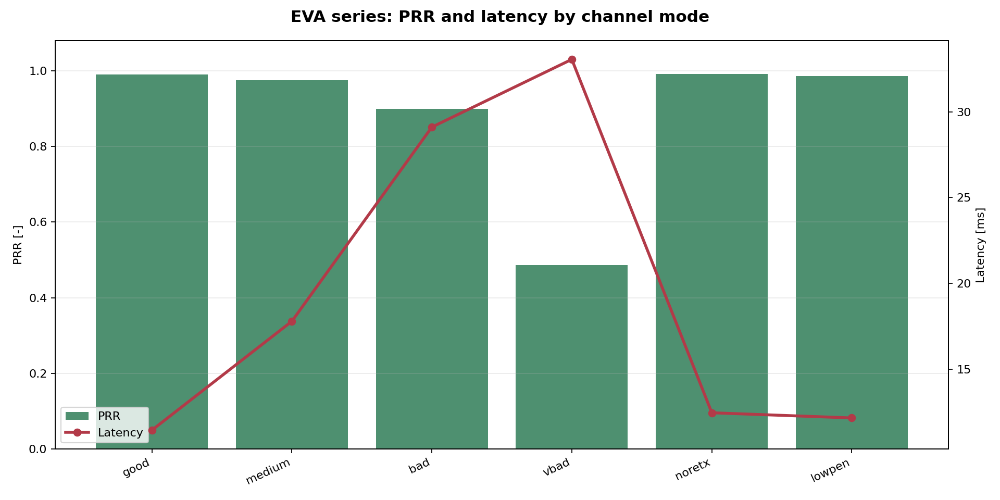
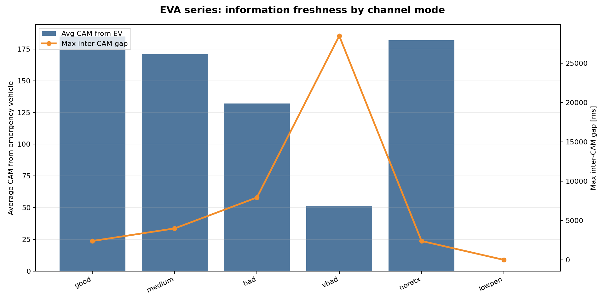

# Цикл 7 - developer report по V2X-наработкам Физулина А.В.

## 1. Назначение документа

Этот документ оформляет выполненную работу за цикл 7 как самостоятельный
developer report. Его можно читать без предварительного знания репозитория:
сначала объясняется исследовательская задача, затем архитектура экспериментов,
после этого - порядок запуска, структура артефактов, доказательные результаты,
ограничения и план следующего шага.

Главная цель отчета - показать, что была проделана не разовая серия запусков,
а собран воспроизводимый исследовательский контур:

`условия связи -> сетевые метрики -> решение автомобиля -> поведение -> исход`

В таком виде работа полезна сразу для трех аудиторий. Для руководителя она
показывает, какой результат уже можно демонстрировать и защищать. Для команды
она объясняет, где находятся сценарии, как их запускать и как читать выходные
данные. Для дальнейшей ВКР/исследовательской работы она фиксирует, какие
артефакты являются доказательными, а какие остаются вспомогательными.

## 2. Краткий итог цикла

За цикл 7 наработки по V2X-сценариям были приведены к состоянию оформленного
экспериментального блока. Смысл результата не в том, что появились отдельные
CSV или картинки, а в том, что теперь есть понятная цепочка от постановки
эксперимента до интерпретации результата.

Итоговые deliverables:

| Блок | Что подготовлено | Статус |
|---|---|---|
| Воспроизводимые сценарии | базовые launchers, валидированные кейсы, пользовательские wrappers | готово |
| Доказательные кейсы | lane-change и intersection crash | готово |
| EVA-серия | 6 прогонов с разными режимами канала и penetration rate | готово |
| Evidence-пакет | summary CSV, causal CSV, PNG, GIF, raw dataset inventory | готово |
| Low-level данные | SQLite inventory и sample CSV по `5G-LENA` | готово |
| Web UI | локальный Scenario Manager для запуска и просмотра результатов | оформлено отдельным блоком |
| Отчетность | задача цикла, карточка, часы, Notion-страница | готово |

Самый важный результат цикла - выделены два центральных кейса, где можно
показать не только деградацию связи на уровне `PRR/latency`, но и наблюдаемое
изменение поведения транспортных средств.

## 3. Исследовательская задача

В обычном сетевом моделировании часто достаточно показать, что один режим дает
выше `throughput`, ниже `latency` или лучше `PRR`. Для connected and automated
vehicles этого недостаточно. В CAV/V2X-контексте сетевой сбой важен не сам по
себе, а потому что он может изменить поведение автомобиля:

- предупреждение приходит поздно;
- сообщение теряется;
- контроллер не получает достаточной информации;
- решение принимается с задержкой;
- маневр выполняется поздно или не выполняется;
- возникает опасный конфликт или столкновение.

Поэтому центральный вопрос цикла был таким:

**как ухудшение V2X-связи проявляется не только в сетевых метриках, но и в
поведенческом исходе сценария?**

В отчете это раскрывается через два типа доказательств. Первый тип - локальные
детерминированные сценарии, где можно проследить конкретную цепочку событий.
Второй тип - sweep/серии прогонов, где видно, как метрики меняются при
изменении параметров канала.

## 4. Объем выполненной работы

Работа была не одной задачей, а набором связанных инженерных и аналитических
шагов.

| Направление | Что сделано | Почему это важно |
|---|---|---|
| Сценарии | собраны основные точки запуска и выделены runnable-кейсы | сценарии можно воспроизводить, а не только описывать |
| Валидированные кейсы | оформлены lane-change и intersection crash | есть два понятных демонстрационных proof-case |
| Post-processing | собраны story plots, timelines, summaries, causal reports | результат можно объяснить и проверить |
| Evidence-пакет | компактные CSV/PNG/GIF вынесены в отдельную папку | отчет не зависит от больших run-директорий |
| EVA-серия | добавлен чувствительный эксперимент из 6 режимов | видна не только точечная история, но и тенденция деградации |
| Raw dataset | добавлен low-level inventory по SQLite-таблицам | есть задел для связи high-level KPI с PHY/MAC-трассами |
| Web UI | оформлен Streamlit Scenario Manager | запуск и просмотр результатов стали доступнее |

Такой формат важен для защиты результата: если оставить только графики, это
выглядит как визуализация. Если оставить только команды запуска, это выглядит
как инженерный черновик. Здесь собраны оба слоя: воспроизводимость и
интерпретация.

## 5. Архитектура исследовательского контура

Система состоит из пяти логических слоев. Их удобно читать сверху вниз, от
дорожной ситуации к итоговой аналитике.

| Слой | Роль | Что дает в результате |
|---|---|---|
| Транспортная среда | движение автомобилей, дороги, маршруты, столкновения | speed/lane/netstate/collision |
| Сетевой слой | V2X-обмен, потери, задержки, PHY/MAC-события | PRR, latency, drops, raw traces |
| Прикладная логика | реакция автомобиля на сообщения и потери | decision, control action, no_action |
| Аналитика | преобразование логов в summaries и plots | CSV, dashboards, causal chains |
| Интерфейсный слой | запуск и просмотр результатов через Web UI | управляемость и демонстрация |

Практически это работает так:

1. SUMO задает дорожную геометрию, маршруты и движение автомобилей.
2. ns-3/NR-V2X моделирует обмен сообщениями между участниками.
3. В сценариях фиксируются доставленные и потерянные сообщения.
4. Прикладная логика принимает решения по событиям связи.
5. Post-processing собирает `drop -> decision -> behavior -> outcome`.
6. Итоговые CSV и графики становятся evidence-слоем отчета.

Главная инженерная идея здесь - не анализировать сеть отдельно от транспорта.
Сетевой слой имеет смысл только вместе с тем, как автомобиль использует или не
использует полученную информацию.

## 6. Минимальный словарь

| Термин | Простое объяснение | Как используется в отчете |
|---|---|---|
| `V2X` | обмен между автомобилями, инфраструктурой и другими участниками | общий контекст работы |
| `CAM` | периодическое сообщение о состоянии автомобиля | основной поток awareness-сообщений |
| `DENM` | сообщение об опасном событии | используется в emergency/incident логике |
| `PRR` | packet reception ratio, доля успешно принятых пакетов | базовая метрика качества связи |
| `Latency` | задержка доставки сообщения | показывает своевременность связи |
| `DROP_PHY` | потеря сообщения на PHY/канальном уровне | вход causal chain |
| `drop_decision_no_action` | решение ничего не делать после потери | важный признак поведенческого сбоя |
| `Collision` | столкновение в SUMO | финальный транспортный исход |
| `Causal chain` | связка `loss -> decision -> behavior -> outcome` | центральная доказательная идея |
| `Sionna` | внешний channel backend для более физически богатого канала | опциональный режим для части сценариев |
| `5G-LENA` | ns-3/NR модель 5G | источник NR-V2X и low-level traces |

## 7. Как поднять и запустить проект

Этот раздел нужен как developer entry point. Он не заменяет README проекта, но
фиксирует рабочую модель запуска, которая использовалась для оформления
результатов.

### 7.1. Базовый принцип запуска

Сценарии запускаются из корня репозитория через shell-launchers. Если уже есть
подготовленное дерево `ns-3-dev`, его можно указать явно:

```bash
export NS3_DIR=/path/to/ns-3-dev
```

Если дерево не указано, launchers умеют искать стандартные расположения и при
необходимости использовать auto-bootstrap. Это снижает риск ситуации, когда
сценарий “есть”, но новый пользователь не может быстро поднять окружение.

### 7.2. Основные команды

Быстрый запуск базовых сценариев:

```bash
scenarios/cttc-nr-v2x-demo-simple/run.sh
scenarios/nr-v2x-west-to-east-highway/run.sh
scenarios/v2v-cam-exchange-sionna-nrv2x/run.sh
scenarios/v2v-coexistence-80211p-nrv2x/run.sh
scenarios/v2v-emergencyVehicleAlert-nrv2x/run.sh
```

Запуск валидированных proof-case:

```bash
valid_scenario/run.sh
valid_intersection_scenario/run.sh
```

Запуск пользовательских wrappers:

```bash
my_scenarios/truck_lane_change_scenario/run.sh
my_scenarios/intersection_crash_scenario/run.sh
my_scenarios/compare_tech/run.sh
my_scenarios/cpm_perception_scenario/run.sh
my_scenarios/intersection_radar_comm_scenario/run.sh
```

### 7.3. Важные переменные окружения

| Переменная | Назначение | Когда менять |
|---|---|---|
| `NS3_DIR` | путь к рабочему дереву `ns-3-dev` | если ns-3 уже подготовлен вручную |
| `OUT_DIR` | выходная директория одиночного запуска | для фиксированных proof-case |
| `OUT_BASE` | корень выходов для sweep-сценариев | для серий прогонов |
| `PLOT` | строить ли графики после запуска | если нужно ускорить run |
| `SUMO_GUI` | включить визуальный SUMO GUI | для демонстрации и отладки |
| `USE_SIONNA` | включить Sionna backend | если поднят Sionna server |
| `EXPORT_RESULTS` | делать export-бандл | для передачи результатов в отчет |
| `AUTO_BOOTSTRAP_NS3` | включить auto-bootstrap ns-3 | если окружение не собрано |

### 7.4. Где искать результаты

Основной pattern такой:

```text
analysis/scenario_runs/<YYYY-MM-DD>/<run-name>/
```

Внутри обычно появляются:

| Путь внутри run | Что там находится |
|---|---|
| `*.log` | stdout/stderr запуска |
| `artifacts/` | CSV, XML, SQLite и производные файлы |
| `figures/` или `visualizations/` | автоматически построенные графики |
| `run_summary.csv` | агрегированная сводка по запуску |
| `REPORT.md` | текстовая интерпретация, если была сформирована |

Для компактной передачи в отчет используется отдельный evidence-пакет:

```text
analysis/cycle7_fizulin_av_report/evidence/
```

Он нужен, чтобы не копировать большие run-директории целиком, но сохранить
ключевые таблицы, графики и GIF.

## 8. Карта сценариев и степень готовности

Сейчас сценарии удобно делить не по папкам, а по назначению.

| Блок | Смысл | Команда | Статус |
|---|---|---|---|
| Минимальный NR-V2X | проверить базовый стек NR sidelink | `scenarios/cttc-nr-v2x-demo-simple/run.sh` | runnable |
| Highway | посмотреть поведение на highway-топологии | `scenarios/nr-v2x-west-to-east-highway/run.sh` | runnable |
| CAM + Sionna | сравнивать CAM delivery с optional Sionna | `scenarios/v2v-cam-exchange-sionna-nrv2x/run.sh` | runnable |
| Coexistence | сравнение 802.11p и NR-V2X | `scenarios/v2v-coexistence-80211p-nrv2x/run.sh` | runnable |
| EVA | emergency vehicle alert, loss/decision/behavior | `scenarios/v2v-emergencyVehicleAlert-nrv2x/run.sh` | основной operational блок |
| Lane-change proof | грузовик, lossy vehicle, перестроение, collision | `valid_scenario/run.sh` | доказательный кейс |
| Intersection proof | priority junction, low PRR, crash chain | `valid_intersection_scenario/run.sh` | доказательный кейс |
| Compare-tech | матричный прогон по технологиям | `my_scenarios/compare_tech/run.sh` | контур подготовлен |
| CPM perception | sensor-only vs CPM modes | `my_scenarios/cpm_perception_scenario/run.sh` | контур подготовлен |
| Radar + comm | radar-only/good-link/bad-link intersection | `my_scenarios/intersection_radar_comm_scenario/run.sh` | контур подготовлен |
| Web UI | запуск и просмотр сценариев из браузера | `tools/scenario_manager/launch.sh` | отдельный инструмент готов |

Практическая логика выбора такая. Если нужно быстро проверить, что стек
собирается, лучше начинать с базовых launchers. Если нужно показать
доказательную связь между сетью и поведением, нужно брать `valid_scenario` или
`valid_intersection_scenario`. Если нужно показать управляемость проекта и
возможность запуска без запоминания команд, используется Web UI.

## 9. Политика доказательности

Чтобы отчет не выглядел как набор красивых, но пустых графиков, материалы
разделены на три уровня.

| Уровень | Что относится | Как использовать |
|---|---|---|
| Основное доказательство | summary CSV, collision time, causal CSV, strict-match metrics | на этом строятся выводы |
| Поддерживающая визуализация | dashboards, speed/lane plots, event timelines, packet raster | помогает объяснить вывод |
| Иллюстрация | GIF, 3D-визуализация, screenshots | полезно для восприятия, но не является proof |

Для ключевых выводов используются именно `CSV` и causal-таблицы. График может
быть встроен рядом, но он не должен быть единственным основанием для вывода.

## 10. Доказательный кейс 1: lane-change

### 10.1. Смысл сценария

Lane-change кейс моделирует ситуацию с грузовиком/инцидентом и несколькими
автомобилями, которые находятся в разных условиях связи. Цель - показать, что
одно и то же дорожное окружение может привести к разным исходам в зависимости
от качества V2X-информации.

Логика сценария:

1. `veh3` получает достаточно сообщений и успевает выполнить безопасный маневр.
2. `veh4` находится в сильно деградированном профиле связи.
3. Потери сообщений у `veh4` приводят к серии `drop_decision_no_action`.
4. Маневр `veh4` происходит слишком поздно относительно collision time.
5. `veh5` показывает промежуточный случай: деградация есть, но collision не
   фиксируется.

### 10.2. Как запустить

Базовый запуск:

```bash
valid_scenario/run.sh
```

С визуализацией SUMO:

```bash
SUMO_GUI=1 valid_scenario/run.sh
```

Fallback без Sionna:

```bash
USE_SIONNA=0 valid_scenario/run.sh
```

Через пользовательский wrapper:

```bash
my_scenarios/truck_lane_change_scenario/run.sh
```

### 10.3. Управляемые параметры

| Параметр | Значение в proof-case | Смысл |
|---|---|---|
| `veh3` profile | `23 dBm`, target `PRR=0.95` | хороший прием, безопасный маневр |
| `veh4` profile | `-20 dBm`, target `PRR=0.077` | сильная деградация, collision chain |
| `veh5` profile | `0 dBm`, target `PRR=0.693` | промежуточный уровень |
| `drop-triggered-reaction` | disabled | drop не вызывает скрытый полезный маневр |
| `CRASH_MODE_ENABLE` | auto | crash-mode включается только для low-PRR случая |
| `COLLISION_ACTION` | warn | столкнувшиеся авто остаются в сцене |

### 10.4. Какие артефакты ожидать

| Артефакт | Назначение |
|---|---|
| `eva-collision.xml` | факт collision в SUMO |
| `drop_decision_timeline/*` | ID-aware связка `DROP_PHY -> DECISION` |
| `collision_causality.csv` | окно событий перед collision |
| `eva-veh*-PROFILE.csv` | профиль dBm/target PRR/drop probability |
| `valid_scenario_story/*` | story-графики по времени |
| `valid_scenario_intuitive/*` | CSV-only графики и summary для отчета |

### 10.5. Подтвержденные результаты

| Транспортное средство | Итоговый PRR | Смысловой исход |
|---|---|---|
| `veh3` | 0.9444 | безопасный маневр до collision |
| `veh4` | 0.2222 | маневр не успевает завершиться, collision подтвержден |
| `veh5` | 0.7500 | деградация есть, но collision не возникает |

Ключевые времена:

- начало инцидента: `6.0 s`
- первое перестроение `veh3`: `7.14358 s`
- первое перестроение `veh4`: `8.13733 s`
- подтвержденное столкновение: `7.95 s`

Дополнительное causal-доказательство:

- `strict match ratio = 1.0`
- число проанализированных drop-events: `787`
- в окне `8 s` перед collision у `veh4` зафиксировано `179` drop-events
- в том же окне зафиксировано `179` событий `drop_decision_no_action`
- последнее релевантное drop-событие: `7.94933 s`, практически вплотную к collision

Это сильный proof-case, потому что совпадают три слоя: низкий PRR,
последовательность no-action decisions и фактический collision.

### 10.6. Как читать графики


На этом графике важно смотреть не просто на линии скорости, а на порядок
событий: когда участники меняют полосу, кто успевает отреагировать до collision,
и кто остается в конфликтной зоне.


Это главный explanatory-график для внешнего показа. Он связывает профиль канала,
наблюдаемый PRR и итоговый исход по конкретным автомобилям.


Timeline нужен для проверки причинного порядка. Если collision был бы раньше
потерь или решений, causal chain была бы слабой. Здесь порядок событий
согласован с выводом.

## 11. Доказательный кейс 2: intersection crash

### 11.1. Смысл сценария

Intersection кейс моделирует конфликт на приоритетном перекрестке. В нем есть
emergency/priority stream и автомобиль с minor stream, который должен уступить.
При высоком качестве связи сценарий должен идти безопасно. При низком качестве
связи у конфликтующего участника появляется цепочка:

`DROP_PHY -> drop_decision_no_action -> crash_mode_forced_speed -> collision`

Сценарий важен тем, что он показывает не lane-change на дороге, а другую
геометрию конфликта: junction, priority, collision на пересечении траекторий.

### 11.2. Как запустить

Базовый crash-профиль:

```bash
valid_intersection_scenario/run.sh
```

Safe A/B режим:

```bash
USE_SIONNA=1 SUMO_GUI=1 \
PHY_ONLY=1 ALLOW_MANUAL_RX_DROP=0 \
VEH3_EQ_DBM=23 VEH3_TARGET_PRR=0.95 \
valid_intersection_scenario/run.sh
```

Crash A/B режим:

```bash
USE_SIONNA=1 SUMO_GUI=1 \
PHY_ONLY=1 ALLOW_MANUAL_RX_DROP=0 \
VEH3_EQ_DBM=-30 VEH3_TARGET_PRR=0.02 \
valid_intersection_scenario/run.sh
```

Через пользовательский wrapper:

```bash
my_scenarios/intersection_crash_scenario/run.sh
```

### 11.3. Что фиксируется

| Объект | Роль |
|---|---|
| `veh2` | emergency/priority participant |
| `veh3` | конфликтующий участник с minor stream |
| `veh4` | connected safe stream, проходит после конфликта |
| `VEH3_TARGET_PRR` | управляет качеством связи у ключевого участника |
| `PHY_ONLY=1` | отключает ручной rx-drop и оставляет PHY/Sionna-логику |
| `collision_causality` | фиксирует окно событий перед collision |

### 11.4. Подтвержденные результаты

| Показатель | Значение |
|---|---|
| наблюдаемый `PRR` от передачи к приему | 0.078947 |
| первое решение “ничего не делать” после drop | 3.8 s |
| первый переход в crash-like forced mode | 4.4 s |
| первое подтвержденное столкновение | 5.23 s |

Дополнительное causal-доказательство:

- `strict match ratio = 1.0`
- число проанализированных drop-events: `30`
- в окне `8 s` перед collision зафиксировано `6` drop-events
- в том же окне зафиксировано `6` событий `drop_decision_no_action`
- последнее релевантное drop-событие: `5.0 s`, незадолго до collision

Важная честная оговорка: для этого run-а `collision_risk_summary.csv` содержит
пустые поля `min_gap_m` и `min_ttc_s`, поэтому основной вывод по intersection
не строится на этих полях. Главная доказательная связка здесь:

`intersection_summary + drop_decision_summary + collision_causality`

### 11.5. Как читать графики


Dashboard показывает поведенческий слой: когда появляются control/decision
события и как они распределены между участниками.


Это explanatory-схема для связи между PHY/network/application/transport layers.
Она полезна для объяснения, но численный вывод надо проверять по CSV.


Network KPI dashboard показывает, что проблема видна уже на уровне доставки
сообщений. Его нужно читать вместе с collision-causality, иначе он будет просто
сетевой картинкой без поведенческого смысла.

## 12. EVA-серия из 6 прогонов

### 12.1. Зачем нужна серия

Два proof-case выше показывают конкретные causal chains. EVA-серия дополняет
их sweep-логикой: она показывает, что ухудшение канала системно влияет на
информационную свежесть и доступность сообщений.

В серии варьировались:

- мощность передачи;
- MCS;
- число передач/ретрансляций;
- bandwidth;
- shadowing;
- penetration rate.

### 12.2. Сводная таблица

| Режим | PRR | Latency, ms | Среднее число CAM от emergency vehicle | Max inter-CAM gap, ms |
|---|---|---|---|---|
| `good` | 0.991558 | 11.4318 | 185 | 2400 |
| `medium` | 0.975313 | 17.7809 | 171 | 4000 |
| `bad` | 0.899322 | 29.1045 | 132 | 7936 |
| `vbad` | 0.486843 | 33.0547 | 51 | 28500 |
| `noretx` | 0.991948 | 12.4486 | 182 | 2400 |
| `lowpen` | 0.986401 | 12.1475 | 0 | 0 |

### 12.3. Выводы

При переходе от `good` к `vbad`:

- `PRR` падает с `0.991558` до `0.486843`;
- средняя задержка растет с `11.4318 ms` до `33.0547 ms`;
- среднее число CAM от emergency vehicle падает с `185` до `51`;
- максимальный inter-CAM gap растет с `2400 ms` до `28500 ms`.

Это важно, потому что `inter-CAM gap` показывает не просто среднее качество
канала, а “дыры” в awareness. Для поведения автомобиля такие провалы могут быть
важнее среднего PRR.

### 12.4. Визуальное чтение серии



Этот график показывает, что ухудшение режима одновременно бьет по двум
направлениям: уменьшается доля доставленных пакетов и растет задержка.



Этот график важен для поведенческой интерпретации: автомобиль не просто
получает меньше сообщений, он дольше остается без обновления состояния
emergency vehicle.

## 13. Low-level блок по 5G-LENA

### 13.1. Зачем он нужен

High-level summaries удобны для отчета, но для инженерной проверки иногда
нужно спуститься ниже: к таблицам передачи, приема, PHY/MAC и ошибкам. Поэтому
в работу добавлен raw dataset-блок по стоковому `5G-LENA` примеру.

Он нужен для трех задач:

1. показать, что в проекте есть доступ к первичным trace-таблицам;
2. подготовить основу для унификации результатов;
3. связать будущие high-level выводы с PHY/MAC evidence.

### 13.2. Что подтверждено

По двум raw `.db` подтверждено наличие таблиц:

- `pktTxRx`
- `pscchRxUePhy`
- `pscchTxUeMac`
- `psschRxUePhy`
- `psschTxUeMac`

То есть есть не только итоговые таблицы “для отчета”, но и низкоуровневый след:
кто передавал, кто принимал, какие были PHY-события, где можно смотреть SINR,
TBLER и corrupt-флаги.

### 13.3. Как использовать дальше

Следующий логичный шаг - сделать адаптер, который будет читать SQLite-таблицы и
приводить их к той же CSV-first схеме, что используется в results pipeline. Это
позволит сравнивать high-level сценарии и low-level 5G-LENA traces в одном
downstream-анализе.

## 14. Web UI для запуска сценариев

В цикле также оформлен отдельный инструментальный результат: локальный Web UI
`NEWWAY Scenario Manager`.

Его задача - снизить порог входа. Вместо того чтобы помнить все команды,
переменные окружения и output-пути, пользователь открывает локальный интерфейс,
выбирает сценарий, читает его описание, задает параметры и запускает run.

### 14.1. Как запустить

```bash
tools/scenario_manager/launch.sh
```

Другой порт:

```bash
PORT=8502 tools/scenario_manager/launch.sh
```

### 14.2. Что умеет UI

| Возможность | Смысл |
|---|---|
| описание сценария | объясняет цель и гипотезу |
| форма параметров | дает менять run без ручной сборки команды |
| запуск | вызывает реальный `run.sh` |
| потоковый лог | показывает ход выполнения |
| summary view | открывает итоговые CSV |
| static plots | показывает PNG из результата |
| browse past runs | позволяет возвращаться к старым прогонам |

### 14.3. Какие сценарии заведены

| Scenario ID | Назначение |
|---|---|
| `burst_vs_random_loss` | loss pattern sweep |
| `density_scaling` | влияние плотности |
| `latency_vs_loss_tradeoff` | loss vs delay |
| `truck_lane_change` | фиксированный lane-change proof-case |
| `intersection_crash` | фиксированный intersection proof-case |

Отдельная Notion-страница по UI:

https://www.notion.so/33dd56dc3dd6812c9e32d95e9c6c4883

## 15. Results pipeline и аналитические скрипты

### 15.1. Зачем нужен pipeline

Сценарий сам по себе дает много файлов, но без post-processing эти файлы трудно
объяснить. Поэтому важная часть работы - scripts, которые переводят run output
в читаемый evidence.

Основной принцип:

`raw artifacts -> normalized/summary CSV -> plots -> interpretation`

### 15.2. Основные скрипты

| Скрипт | Что делает |
|---|---|
| `build_drop_decision_timeline.py` | строит ID-aware timeline `DROP_PHY -> DECISION` |
| `build_collision_causality_report.py` | выделяет окно событий перед collision |
| `build_valid_scenario_story_plots.py` | строит story-графики SUMO + ns-3 |
| `build_valid_scenario_intuitive_plots.py` | строит CSV-only графики для понятного отчета |
| `analyze_netstate_collision_risk.py` | считает safety proxy из SUMO netstate |
| `export_results_bundle.py` | собирает компактный export-бандл |
| `analyze_all_logs.py` | делает аудит логов по run-директориям |

### 15.3. Results schema MVP

Для дальнейшей унификации уже зафиксирована CSV-first схема. В ней ожидаются:

- `normalized_events.csv`
- `aggregates_overall.csv`
- `diagnostics.csv`
- `run_metadata.json`
- `run_metadata.yaml`

Ключевые нормализованные поля:

- `run_id`
- `scenario`
- `event_type`
- `ts_us`
- `src_id`
- `dst_id`
- `pkt_id`
- `latency_us`
- `rssi_dbm`
- `sinr_db`
- `bler`
- `success`
- `drop_reason`

Это пока MVP, но он уже задает направление: разные источники результатов должны
попадать в общий downstream-анализ без переписывания всей логики под каждый
сценарий отдельно.

## 16. Ограничения и риски

| Область | Ограничение | Как с этим работать |
|---|---|---|
| Окружение | часть сценариев чувствительна к версиям SUMO, Python, ns-3 | фиксировать команды запуска и env vars |
| Sionna | требует поднятого server и корректной сетевой связности | иметь fallback `USE_SIONNA=0` там, где это допустимо |
| Intersection safety summary | `min_gap_m/min_ttc_s` в одном run-е пустые | не использовать этот файл как главный proof |
| Расширенные сценарии | compare-tech/CPM/radar не все закрыты финальными summary | описывать как подготовленные контуры, не как завершенные результаты |
| Web UI | локальный research-интерфейс, не production | использовать для запуска и демонстрации, не как deployed service |
| Raw 5G-LENA | есть inventory/sample, но не полный адаптер | следующий шаг - SQLite -> normalized CSV |

Эти ограничения не обнуляют результат. Наоборот, они делают отчет честнее:
понятно, где уже есть proof, а где есть подготовленный, но не полностью закрытый
контур.

## 17. Задача цикла и оценка часов

**Физулин А.В.**

**Зона ответственности:** воспроизводимые V2X-сценарии, доказательная
аналитика, артефакты экспериментов, Web UI и отчетность.

Содержательно задача цикла состояла в том, чтобы:

1. систематизировать основные сценарии и способы их запуска;
2. оформить воспроизводимые пользовательские и валидированные кейсы;
3. собрать доказательные артефакты экспериментов;
4. показать контур `связь -> решение -> поведение/исход`;
5. подготовить подробный отчет и отдельный Web UI блок.

Результат на выходе:

- целостный developer report;
- карта сценариев и команд запуска;
- подтвержденные CSV/PNG/GIF-артефакты;
- оформленные lane-change и intersection proof-case;
- EVA-серия из 6 прогонов;
- low-level 5G-LENA dataset-блок;
- отдельный Web UI Scenario Manager report.

Оценка по основному V2X/report блоку:

| Блок работ | Часы |
|---|---|
| Изучение и систематизация структуры сценариев и среды | 8 |
| Подготовка и оформление воспроизводимых сценариев | 10 |
| Работа с доказательными кейсами и артефактами | 14 |
| Аналитика, export и сводные результаты | 8 |
| Документация и сборка итогового отчета | 8 |
| **Итого** | **48** |

Отдельный Web UI блок оценен в `18 ч` и оформлен отдельной задачей/страницей.

## 18. Что готово для следующего цикла

Следующий цикл логично строить не с нуля, а поверх уже оформленного контура.

Приоритетные шаги:

1. Дозакрыть quantitative summary для `compare_tech`, `CPM` и `radar+comm`.
2. Расширить results pipeline на больше источников, включая SQLite/5G-LENA.
3. Связать low-level PHY/MAC traces с high-level KPI.
4. Добавить в Web UI сравнение нескольких запусков.
5. Подготовить boss-facing demo flow: открыть UI, запустить proof-case, показать
   summary, открыть Notion report.
6. Использовать текущий отчет как основу для ВКР/академического текста.

Фактически за цикл уже подготовлена база, на которой можно строить следующий
этап: не “у нас есть папка с экспериментами”, а “у нас есть воспроизводимый
контур сценариев, результатов, доказательств и документации”.
